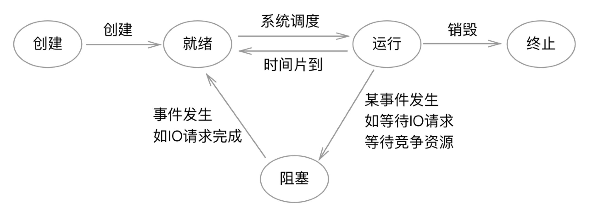

# 同步与阻塞的区别与联系

## 何谓同步

在大多数情况下，``同步``是相对于``异步``而言的。在iOS开发中，同步主要涉及两个语义：``同步调用``与``线程同步``。这里我们主要讨论的是线程同步。

### 同步调用

``同步调用``指的是我们在调用一个函数时，立刻可以得到运行结果，并进行后续的操作。

```
NSString *message = [self getMessage];
// do something
```

与之相对的，``异步调用``指的是在我们调用一个函数的时候，并不能立刻得到运行结果。而是在运行完成时，通过回调函数、代理事件、通知等方式告知我们，并进行后续操作。

```
[self fetchMesssageWithCompletion:^(NSString *message) {
      // do something
}];


[self getMessage];
- (void)didReceiveMessage:(NSString *)message
{
    // do something
}

```


### 线程同步

``线程同步``，一种线程间的``直接制约关系``，是指多个线程（或进程）为了合作完成任务，步调一致的执行。

- 同一时刻，只能有一个线程执行。有一个线程在执行，则其他线程等待。
- 线程之间可以指定特定的顺序依次执行，也可以在当前执行线程完成之后，进行竞争

值得注意的是只有一个线程，或者相同的线程之间是不能称之为同步的。

### 何时需要线程同步

#### 线程间的通讯与资源共享

多个线程之间要想步调一致的执行，必须保持彼此之间的有效沟通。尤其是在线程之间存在着一个或多个共享资源时。

- 保持各个线程之间共享资源的数据一致性
- 其他线程对于共享资源的操作，必须及时告之其他线程。

#### 线程间存在某种关联

如果两个线程之间没有任何关联，那么他们之间的同步是毫无意义的。如果两个或多个线程是同步的那么他们之间必然存在着某种关联。

- 一个线程的执行，会对其他线程的运行结果产生影响。
- 一个线程的执行依赖另一个线程的运行结果。

值得注意的是，现实开发中，这种关联存在一线程当中某些关键任务与另一个线程的某些任务之间，并不存在与整个线程生命周期。通常来说是，线程间某些任务之间的相互关联，相互影响。

### 同步往往伴随着互斥

如果多个线程之间是同步的，那么他们之间的执行往往是互斥的。也就是说，在任意时刻，他们都不可能同时执行。当一个线程正在执行时，其他线程必须进入等待状态，等该线程执行结束之后，才以恰当的方式（事件队列、线程优先级、竞态条件）争夺执行的机会。

值得注意的是，这种互斥往往只在执行某些特定任务时（通常是涉及共享数据的操作）发生。一个线程整个生命周期都与其他线程互斥，这是很少见的。除非该线程只用于处理特定的任务事件。

同步是更为复杂的互斥，同步与互斥的区别参见[这篇文章](http://blog.csdn.net/lisonglisonglisong/article/details/45371655)


## 阻塞

广义上的阻塞，指的是某一段代码、某个任务事件的执行耗费了了大量的时间，或者耗时不确定，阻碍了程序继续往下运行。

而狭义上的阻塞，等同于线程的挂起，指的就是在下述状态模中进入了阻塞状态，线程挂起，等待某个事件发生以将其唤醒。



- 线程创建成功之后进入就绪状态，等待操作系统调度
- 系统调度获得时间片之后，进入运行状态
- 时间片消耗光之后，进入就绪状态，继续等待系统调度
- 当某些事件发生时，譬如在争夺某个系统资源时，需要等待其他任务完成，或者自己主动挂起。会进入阻塞状态、或者称之为挂起状态。
- 当所要等待的事件发生，或被主动唤醒时，进入就绪状态，等待操作系统调度
- 当线程所有操作结束时，线程终止并销毁。

## 某些情况下同步意味着阻塞

在通常情况下，同步往往伴随着线程阻塞。如果多个线程之间是同步的，当一个线程执行时，其他线程必须等待。而等待有好几种方式，通常是线程挂起，也就是阻塞。

GCD在同步派发时，当前线程会发生阻塞，等待目标线程的目标任务执行完毕才唤醒。除了自旋锁之外，所有用以实现互斥效用的锁，在实现同步操作时，都会阻塞。

```
dispatch_queue_t queueA = dispatch_queue_create("A", DISPATCH_QUEUE_SERIAL);
dispatch_sync(queueA, ^{
    NSString *message = [self getMessage];
    NSLog(@"%@", message);
});
```

## 同步非阻塞情形

在进行线程同步时，如果处于等待状态的线程没有发生阻塞，或则说没有挂起，继续暂用着CPU的时间片，即同步非阻塞情形。这种情形一般是异部调用，同步轮询。轮询包括空转轮询、定时循序

- 线程在等待时不挂起，而是空转。用自旋锁实现同步是很好的例子。也可以自己启循环，譬如下述代码示例：


```
dispatch_queue_t q1 = dispatch_queue_create("1", DISPATCH_QUEUE_SERIAL);
    
    __block int result = 0;
    dispatch_async(q1, ^{
        
        sleep(2);
        
        result = 56;
    });
    
    while (!result) {
        // do something
    }
    
    NSLog(@"result = %d",result);
    // do something

```

- 线程不挂起，而是定时监测共享资源的状态。

```
dispatch_queue_t q1 = dispatch_queue_create("1", DISPATCH_QUEUE_SERIAL);
    
__block int result = 0;
dispatch_async(q1, ^{
    
    sleep(2);
    
    result = 56;
});
    
NSTimer *timer = [NSTimer timerWithTimeInterval:0.1 repeats:YES block:^(NSTimer * _Nonnull timer) {
    if (result) {
        // do something
        NSLog(@"result = %d",result);
        [timer invalidate];
    }
}];
[[NSRunLoop mainRunLoop] addTimer:timer forMode:NSRunLoopCommonModes];
```

## 阻塞非同步情形

单纯将线程挂起，而不进行任何线程之间的同步操作，即是此种情形。


